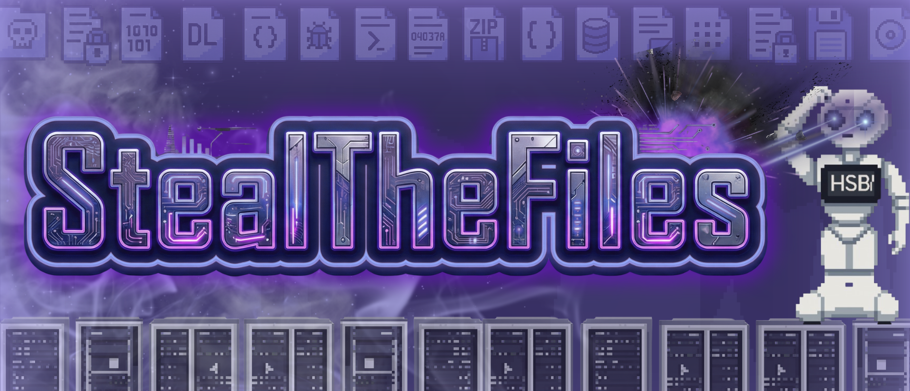
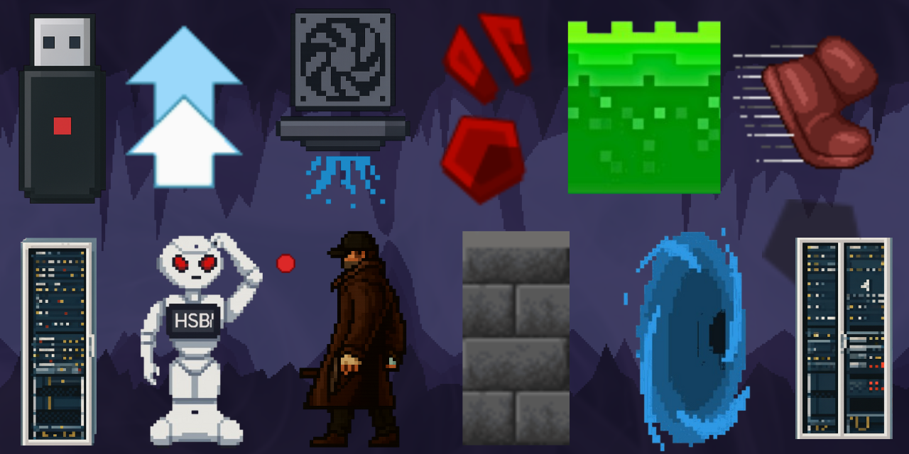

  

# Dokumentation

Wintersemester 2025/26 – HSBI Campus Minden Programmieren 1 - Testat – Autoren: Tom Coombs, Leonardo Rosario Parrino 

---
## Inhaltsverzeichnis

- [1. Konzept & Projektidee](#1-konzept--projekteidee)
- [2. Entwicklungsumgebung & genutzte Dependencies](#2-entwicklungsumgebung--genutzte-dependencies)
  - [2.1 Entwicklungsumgebung & Java Versionen](#21-entwicklungsumgebung--java-versionen)
  - [2.2 Maven Dependencies](#22-maven-dependencies)
- [3. LLMs](#3-llms)
- [4. Softwarearchitektur & Design-Patterns](#4-softwarearchitektur--design-patterns)
  - [4.1. Custom Event-Bus (Reflection-Based)](#41-custom-event-bus-reflection-based)
  - [4.2. Logging-Strategie](#42-logging-strategie)
  - [4.3. Game-Loop & Threading](#43-game-loop--threading)
  - [4.4. Entity-System & Serialisierung](#44-entity-system--serialisierung)
- [5. Datenhaltung, Audio & Networking](#5-datenhaltung-audio--networking)
  - [5.1. Audio-Engine (Ducking & Caching)](#51-audio-engine-ducking--caching)
  - [5.2. Multithreaded Networking](#52-multithreaded-networking)
  - [5.3. Internationalisierung (I18n)](#53-internationalisierung-i18n)
- [6. Build & Deployment (Verteilung)](#6-build--deployment-verteilung)
  - [6.1. Custom Runtime Image (JLink)](#61-custom-runtime-image-jlink)
  - [6.2. Native Installer (JPackage)](#62-native-installer-jpackage)
  - [7. Herausforderungen & Technische Lösungen](#7-herausforderungen--technische-lösungen)
---

## 1. Konzept & Projekteidee

- Allgemein soll es einen einfachen 2D-Platformer abbilden.
- Es gibt einen Spieler, welcher versucht bis zum Level-Ziel zu kommen und dabei so viele Ordner (mit Klausuren) wie möglich einsammelt.
  - Dieser Ordner befinden sich über das ganze Level verteilt.
- Die Steuerung soll sich mit `A`, `D` und `SPACE` einfach halten und ein intuitives Spielerlebnis bieten.
- Geplant war auch die Umsetzung eines Mehrspielermodus, welcher ermöglichen soll, in einer großen gemeinsamen Map zu spielen.

## 2. Entwicklungsumgebung & genutzte Dependencies 

### 2.1 Entwicklungsumgebung & Java Versionen
- **IDE:** IntelliJ IDEA (Community Edition)
- **Java Version:** Amazon Corretto SDK 19.0.2
- **JavaFX Version:** SDK-17.0.6

### 2.2 Maven Dependencies

| Artefakt | Link | Beschreibung |
| :--- | :--- | :--- |
| **Log4j** | [mvnrepository](https://mvnrepository.com/artifact/log4j/log4j) | Logging-Framework für Fehler- und Statusmeldungen. |
| **Lombok** | [mvnrepository](https://mvnrepository.com/artifact/org.projectlombok/lombok) | Reduziert Boilerplate-Code (Getter, Setter, Konstruktoren) durch Annotationen. |
| **MySQL Connector** | [mvnrepository](https://mvnrepository.com/artifact/mysql/mysql-connector-java) | JDBC-Treiber für die Verbindung zur MySQL-Datenbank. |
| **HikariCP** | [mvnrepository](https://mvnrepository.com/artifact/com.zaxxer/HikariCP) | Performanter JDBC Connection Pool für effiziente Datenbankverbindungen. |
| **Gson** | [mvnrepository](https://mvnrepository.com/artifact/com.google.code.gson/gson) | Bibliothek zur Serialisierung und Deserialisierung von JSON-Daten. |
| **JavaFX Controls** | [mvnrepository](https://mvnrepository.com/artifact/org.openjfx/javafx-controls) | **Das Hauptmodul für die GUI-Elemente** (Buttons, Labels, Checkboxen, etc.). |
| **JavaFX FXML** | [mvnrepository](https://mvnrepository.com/artifact/org.openjfx/javafx-fxml) | Ermöglicht das **Deklarieren der Benutzeroberfläche** in XML-Dateien, getrennt von der Java-Logik. |
| **JavaFX Graphics** | [mvnrepository](https://mvnrepository.com/artifact/org.openjfx/javafx-graphics) | Stellt die Kern-API für das Rendern von Grafiken bereit (wird von Controls/FXML benötigt). |
| **JavaFX Media** | [mvnrepository](https://mvnrepository.com/artifact/org.openjfx/javafx-media) | Modul zur Integration von Audio und Video (z.B. Player-Funktionalität). |

**Erklärung warum sich für bestimmte Dependencies entschieden wurde:**

- Lombok: Dieses Tool nutze ich bereits seit vielen Jahren und dadurch weiß ich gut, wie hilfreich es sein kann, um einiges ein Code zu sparen. Vor allem in Klassen mit vielen Attributen ist Lombok eines der besten Tools um eine gute und organisierte Codestruktur zu behalten.
- Log4j: Das Tool ist nur für das Loggen vorhanden. Auch wenn unser Projekt nicht allzu viele Stellen hat, wo etwas geloggt wird, ist es trotzdem hilfreich, um in späteren Szenarien bereits eine gute Codestruktur zu haben, bei welcher die Implementation eines Loggingsystem super einfach ist.
- HikariCP & MySQL: Dieses beiden Dependencies sind im Server-Modul vorhanden und dienen schlicht dazu eine Datenbankverbindung herzustellen. HikariCP ist dazu der aus meiner Erfahrung mit Abstand performanteste JDBC-Verbindungspool und ermöglicht eine stabile Datenbankverbindung mit sehr geringer Latenz.
- Gson: Gson wird einfach nur genutzt um die JsonConfig einfach zu Verwalten und um aus einer JSON-Datei eine Javaklasse zu generieren.

## 3. LLMs

Allgemein wurden in diesem Projekt so gut wie keine LLMs zur Generierung des Quelltextes verwendet. Der Hintergrund ist vor allem, dass ich (Tom) bereits fast eine Dekade an Programmiererfahrung und viele Jahre in IT-Unternehmen als Fullstack-Developer habe und somit bereits einiges an Kennwissen besitze. 
 
Trotzdem wurden für Teillösungen LLMs genutzt, da es zum einen Aufgabe war und zum anderen LLMs wie Copilot, Tabnine oder Codex genutzt.
 
Dabei konnte auch festgestellt werden, dass LLMs für einige Probleme sehr hilfreich sind. Vor allem bei Probleme welche normaler weiße etwas komplexer sind, wie z.B. die Implementierung der Kamera, konnten die LLMs Teile unserer Probleme bei der Implementation einer solchen beheben. 

**Verwendetes Modell: Gemini 2.0 Flash Thinking**

<strong>Hier klicken, um die verwendeten Prompts anzuzeigen</strong>

 

**Prompt 1: Der Überblick (Design-Fokus)**
> "Ich entwickle einen 2D-Platformer in JavaFX und suche nach einer besseren Kamera-Lösung als der starren Spieler-Fixierung. Kannst du mir eine Übersicht der gängigen Systeme (z.B. Deadzones, Smoothing, Look-Ahead) geben? Mich interessieren besonders die Auswirkungen auf das 'Game Feel' und welches Genre typischerweise welche Methode nutzt, damit ich das richtige Konzept für mein Spiel wählen kann."

**Prompt 2: Die Technik (Mathematik & Code-Logik)**
> "Mein JavaFX-Kameracode (hartes setTranslateX) wirkt steif und ruckelig. Ich möchte das flüssige Verhalten moderner Platformer (Hollow Knight) erreichen. Kannst du mir die Mathematik hinter 'Position Smoothing' (Lerp) erklären und wie ich das sauber in einen AnimationTimer einbaue? Wichtig ist mir auch das 'Clamping', damit die Kamera nicht über den Levelrand hinausfährt. Ich möchte die Logik verstehen, um sie selbst zu implementieren."

**Prompt 3: Die Entscheidung (Pro/Contra Analyse)**
> "Ich muss eine fundierte Design-Entscheidung für meine Kamera treffen. Bitte erstelle mir eine Vergleichsanalyse (Vor-/Nachteile) für: Locked, Deadzone, Smoothing und Look-Ahead. Bewerte sie bitte nach Implementierungsaufwand, Game Feel/UX und Genre-Eignung. Ich brauche diese Argumente, um meine Wahl im Projekt technisch begründen zu können."

## 4. Softwarearchitektur & Design-Patterns

Das Projekt folgt einer strikten Trennung zwischen Logik, Daten und Darstellung (MVC-Ansatz). Neben dem Singleton-Pattern und dem State-Pattern sind folgende komplexe Systeme zentral:

### 4.1. Custom Event-Bus (Reflection-Based)
Anstatt auf Standard-JavaFX-Events beschränkt zu sein, wurde ein eigenes, hochflexibles Event-System implementiert.

* **Funktionsweise:** Über die Annotation `@EventHandler` markierte Methoden werden zur Laufzeit mittels **Java Reflection** registriert und dynamisch aufgerufen.
* **Loose Coupling:** Das System entkoppelt Komponenten vollständig. Beispiel: Das `PlayerDamageEvent` enthält alle Infos über Schaden (`DamageCause`, `newHealth`), ohne dass der Auslöser (z.B. ein Gegner) die Spieler-Klasse direkt manipulieren muss.
* **Cancellable Events:** Events können abgebrochen werden (`setCancelled`), um Logik wie Schaden im "GodMode" zu unterbinden.

### 4.2. Logging-Strategie
Zur Fehleranalyse wird **Log4j** eingesetzt. Die Konfiguration (`log4j.properties`) definiert eine duale Strategie:

* **Console:** Direkte Ausgabe in die IDE für Entwicklung.
* **File-Rotation:** Es wird parallel in eine `latest.log` und eine timestamp-basierte Datei (`logs/log_${startTime}.log`) geschrieben. Dies ermöglicht eine nachträgliche Fehleranalyse bei Abstürzen, ohne alte Logs zu überschreiben.

### 4.3. Game-Loop & Threading
Der `ScreenManager` trennt die Programmlogik vom JavaFX-Rendering-Thread.

* **Dedizierter Thread:** Ein eigener Thread (`gameLoop`) berechnet Physik und Spielzustände.
* **Synchronisation:** Grafische Updates werden über `Platform.runLater()` sicher an die UI übergeben.

### 4.4. Entity-System & Serialisierung
Die Spielobjekte sind netzwerkfähig konzipiert. Jede `Entity` besitzt eine `UUID` und ist `Serializable`. Dadurch können komplette Spielerobjekte direkt über den TCP-Stream gesendet werden, was die Multiplayer-Synchronisation massiv vereinfacht.

## 5. Datenhaltung, Audio & Networking

### 5.1. Audio-Engine (Ducking & Caching)
Der `SoundManager` fungiert als professionelle Audio-Engine.

* **Caching:** Audiodateien werden beim ersten Zugriff in einer `HashMap` gecacht (`mediaCache`), um Nachladeruckler zu vermeiden.
* **Ducking:** Wenn wichtige Sounds (z.B. Achievements oder Buffs) spielen, wird die Hintergrundmusik temporär und thread-safe (`synchronized`) leiser geregelt, damit das akustische Feedback klar hörbar bleibt.

### 5.2. Multithreaded Networking
Der Netzwerk-Client nutzt einen `ExecutorService` (`CachedThreadPool`), um Blockaden im Hauptthread zu vermeiden.

* **ReceiverTask:** Wartet blockierend auf eingehende Pakete (`dis.read`) und verarbeitet diese im Hintergrund.
* **SenderTask:** Sendet asynchron in festen Intervallen (alle 50ms) Positionsupdates.
Dies entkoppelt die Netzwerklatenz vollständig von der Framerate des Spiels.

### 5.3. Internationalisierung (I18n)
Texte sind nicht hard-coded. Der `MessageHandler` lädt Übersetzungen (DE, EN, RU) aus einer JSON-Datei und unterstützt Platzhalter (z.B. `{0}`), um Nachrichten dynamisch zur Laufzeit zu generieren.

## 6. Build & Deployment (Verteilung)

Ein technisches Highlight ist der Build-Prozess, der das Spiel unabhängig von einer vorinstallierten Java-Version macht.

### 6.1. Custom Runtime Image (JLink)
Mittels `jlink` wird eine maßgeschneiderte Java-Runtime erstellt, die nur die wirklich benötigten Module (`javafx.controls`, `javafx.media`, etc.) enthält. Dies reduziert die Größe der Anwendung drastisch (`--strip-debug`, `--compress=2`).

### 6.2. Native Installer (JPackage)
Das Skript `start_app_bundler.bat` nutzt das JDK-Tool `jpackage`, um aus der JAR-Datei und der Custom-Runtime eine native Windows-Anwendung (`.exe` / Installer) zu generieren.

* **Vorteil:** Der Endnutzer muss kein Java installieren; alles Notwendige wird mitgeliefert ("Self-Contained Application").
* **Obfuscation:** Das Build-Skript verweist auf eine `client_obfuscated.jar`, was zeigt, dass der Code vor Decompilierung geschützt wurde.

## 7. Herausforderungen & Technische Lösungen

Während der Entwicklung stießen wir auf technische Herausforderungen, die durch spezifische Algorithmen und mathematische Ansätze gelöst wurden:

* **Problem: Performance bei großen Leveln (Rendering)**
    * *Lösung: View Frustum Culling.*
        In der Klasse `Platform` wird geprüft, ob eine Kachel (Tile) im sichtbaren Kamerabereich liegt. Ist sie außerhalb, wird sie unsichtbar geschaltet oder gar nicht erst berechnet. Das hält die FPS auch in riesigen Leveln stabil.

* **Problem: Frame-Rate-Unabhängige Animationen**
    * *Lösung: Delta-Time Accumulator.*
        Damit Animationen (z.B. Lava oder drehende USB-Sticks) auf allen PCs gleich schnell laufen, wird `System.nanoTime()` genutzt. Die vergangene Zeit wird akkumuliert und Frames werden erst gewechselt, wenn ein definierter Schwellenwert überschritten ist.

* **Problem: Statische Bewegungsmuster**
    * *Lösung: Mathematische Bewegungsmodelle.*
        * **Hovering:** `EntityMovingPlatform` nutzt eine Sinus-Funktion (`Math.sin`), um ein sanftes Schweben zu simulieren.
        * **Interpolation:** `FloatingPlatformBlock` nutzt Vektormathematik, um sich flüssig zwischen zwei Punkten zu bewegen (Lerp).

* **Problem: Gegner-KI und Kollision**
    * *Lösung: Clamped Vector Movement.*
        Der `RobotEnemyBlock` berechnet die Richtung zum Spieler, begrenzt die Bewegung aber strikt auf einen definierten Bereich (`minX`, `maxX`). Dies verhindert, dass Gegner blindlings von Plattformen laufen.

* **Problem: Audio-Konflikte (Race Conditions)**
    * *Lösung: Synchronisation.*
        Da Musik und Soundeffekte in unterschiedlichen Threads laufen können, werden kritische Audio-Operationen (wie das Ducking) durch ein Lock-Objekt (`duckLock`) synchronisiert. Dies verhindert inkonsistente Lautstärkepegel bei gleichzeitigen Events.

## 8. Game Assets & Design

Die visuelle Gestaltung des Spiels basiert auf einem eigens erstellten Sprite-Sheet, das alle relevanten Spielobjekte in einer einzigen Textur bündelt. Dies reduziert "Draw Calls" und verbessert die Performance erheblich.

  

Das Asset-Pack umfasst folgende Elemente:

* **Charaktere:**
    * **Player-Figur:** Der Protagonist des Spiels.
    * **Robot Enemy:** Der Gegner wurde inspiriert durch das Design auf der [HSBI Informatik-Bachelor Seite](https://www.hsbi.de/studiengaenge/informatik-bachelor).

* **Umgebung & Setting:**
    * **Server-Schränke:** Um das Setting authentisch zu gestalten, wurden zwei Varianten erstellt, deren Texturen auf Fotos des [HSBI Labors für Angewandte Informatik](https://www.hsbi.de/ium/studium/labore/angewandte-informatik) basieren.
    * **Plattformen:** Grafiken für statische Böden sowie **schwebende Plattformen**.
    * **Gefahren:** Grüne Säure/Lava als Hindernis.
    * **Level-Elemente:** Ein **Portal** für den Level-Abschluss.

* **Items & UI:**
    * **USB-Stick:** Das Sammelobjekt (Ziel des Spiels).
    * **Power-Ups:** Speedboost und Jumpboost.
    * **UI:** Eine integrierte Lebensanzeige (Health Bar).

---

**Name:** Leonardo Rosario Parrino  
**Matrikelnummer:** 50197039  
**Zum Projekt:** StealTheFiles

<strong>Reflexion und Fazit anzeigen</strong>

Das Projekt **„StealTheFiles“** stellte für mich weit mehr dar als eine spielerische Aufgabe; es war der entscheidende Schritt, um die theoretischen Vorlesungsinhalte in ein funktionierendes Softwaresystem zu überführen. Besonders die hohe Komplexität der verschiedenen Subsysteme – von der Bewegungslogik über Kollisionsabfragen bis hin zum Event-Handling und UI – verdeutlichte mir die Notwendigkeit einer sauberen **Softwarearchitektur**. Ich habe gelernt, Interdependenzen zwischen Modulen frühzeitig zu erkennen und technisch sauber zu lösen, was mein Verständnis für das technische „Big Picture“ nachhaltig geschärft hat.

Auf methodischer Ebene konnte ich meinen Umgang mit **Versionsverwaltung** professionalisieren. Die Nutzung von GitHub ging über bloßes Speichern hinaus: Strukturierte Commits und ein sauberer Workflow waren essenziell für die Nachvollziehbarkeit und die kollaborative Entwicklung. Auch die **Teamarbeit** war ein Schlüsselfaktor; wir haben gelernt, Aufgaben effizient zu parzellieren und uns bei Engpässen gegenseitig zu unterstützen, was den Entwicklungsprozess deutlich beschleunigte und professionalisierte.

Ein besonderes Augenmerk legte ich auf den reflektierten Umgang mit modernen Tools wie **LLMs**. Ich nutzte KI als unterstützendes Werkzeug, erkannte jedoch schnell die Grenzen und die Gefahr einer "blinden Übernahme". Dies schärfte mein Verständnis dafür, dass die Problemlösungskompetenz und die Kontrolle über den Code stets beim Entwickler bleiben müssen.

Rückblickend war das Projekt nicht nur kognitiv fordernd, sondern auch eine Quelle großer Motivation. Das „Flow-Erleben“ während der Programmierung und das erfolgreiche Zusammenfügen der Komponenten haben mir ein stabiles technisches Fundament verschafft und meine Begeisterung für die Softwareentwicklung bestätigt.

